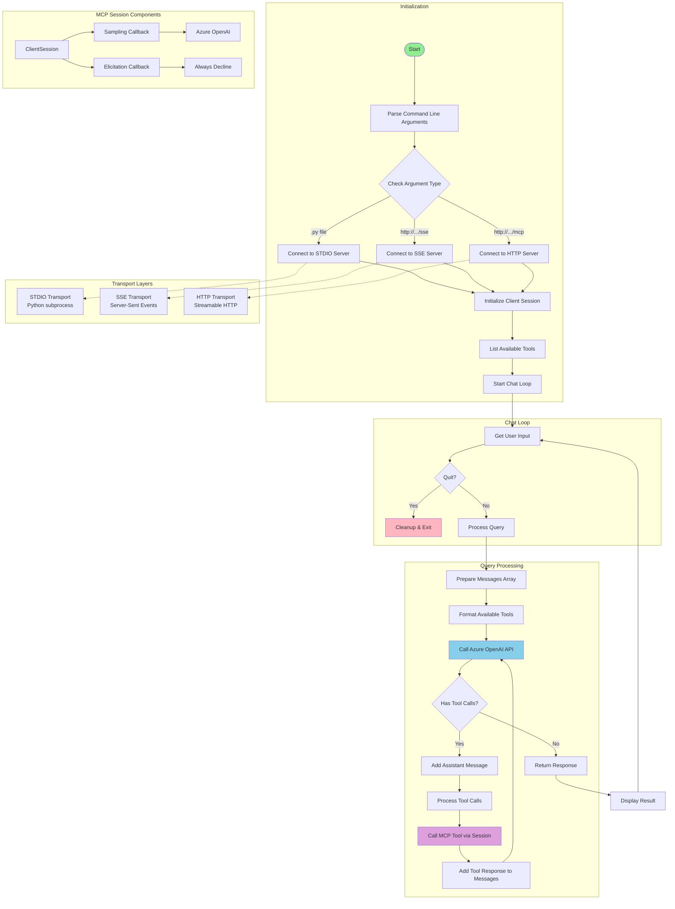
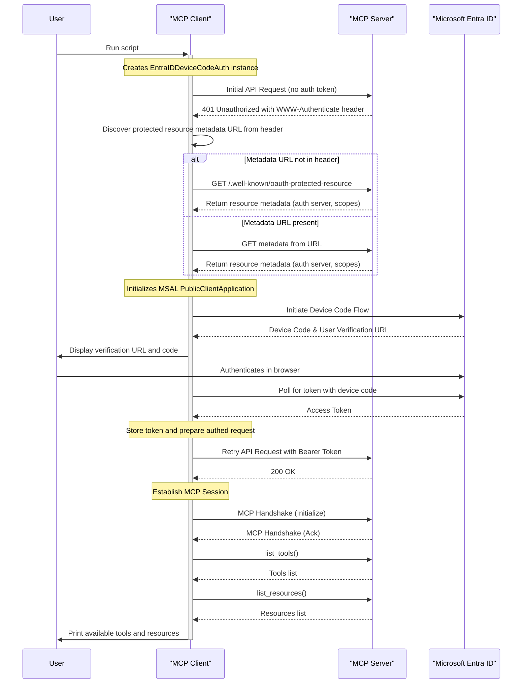
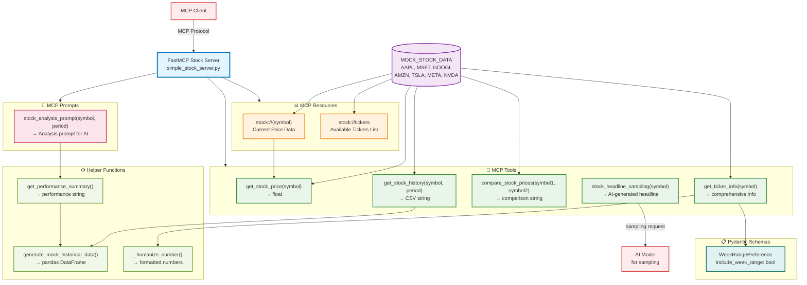
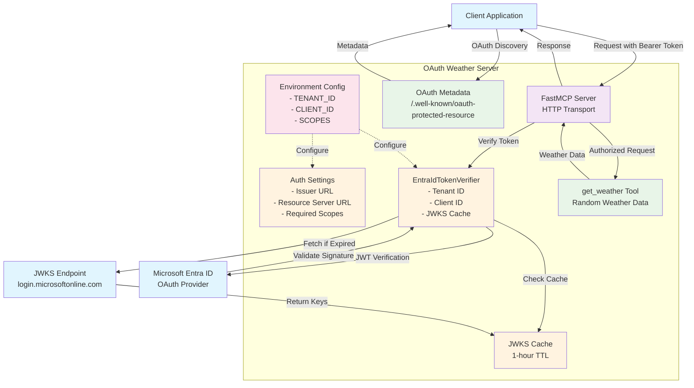

# MCP Workshop

## Table of Contents
1. [Introduction to MCP](#introduction-to-mcp)
2. [Core MCP Concepts](#core-mcp-concepts)
3. [Workshop Setup](#workshop-setup)
4. [Console Client](#console-client)
5. [EntraID Client](#entraid-client)
6. [Demo 1: Basic Stock Server](#demo-1-basic-stock-server)
7. [Demo 2: OAuth-Protected Weather Server](#demo-2-oauth-protected-weather-server)
8. [Demo 3: Secure Access to MCP Servers in Azure APIM](#demo-3-secure-access-to-mcp-servers-in-azure-apim)
9. [Hands-on Exercises](#hands-on-exercises)
10. [Key Takeaways](#key-takeaways)
11. [Resources](#resources)
12. [Next Steps](#next-steps)

## Introduction to MCP

The **Model Context Protocol (MCP)** is an open standard that enables AI assistants to securely connect to data sources and tools. Think of it as a universal API that allows language models to interact with external systems in a standardized way.

### Why MCP?
- **Standardization**: One protocol for all integrations
- **Security**: Built-in authentication and authorization
- **Flexibility**: Supports multiple transport methods
- **Extensibility**: Easy to add new capabilities

## Core MCP Concepts

### 1. Resources
Resources are read-only data sources that can be accessed by AI models. They represent information that the model can read but not modify.

**Example from our stock server:**
```python
@mcp.resource("stock://{symbol}")
def stock_resource(symbol: str) -> str:
    """Expose stock price data as a resource."""
    price = get_stock_price(symbol)
    return f"The current price of '{symbol}' is ${price:.2f}."
```

### 2. Tools
Tools are functions that AI models can call to perform actions or retrieve dynamic data. Unlike resources, tools can have side effects.

**Example from our stock server:**
```python
@mcp.tool()
def get_stock_price(symbol: str) -> float:
    """Retrieve the current stock price for the given ticker symbol."""
    # Tool implementation
```

### 3. Prompts
Prompts are reusable templates that help structure interactions with AI models. They provide context and formatting for specific use cases.

**Example from our stock server:**
```python
@mcp.prompt("stock_analysis_prompt")
def stock_analysis(symbol: str, period: str = "1mo"):
    """Build a prompt for analyzing a stock's recent performance."""
    # Returns formatted prompt messages
```

### 4. Sampling
Sampling allows MCP servers to request completions from the connected AI model, enabling interactive and context-aware responses.

**Example from our stock server:**
```python
@mcp.tool()
async def stock_headline_sampling(symbol: str, ctx: Context[ServerSession, None]) -> str:
    """Use MCP sampling to generate a market-style headline."""
    # Uses the client's model to generate content
```

### 5. Elicitation
Elicitation refers to the process of gathering information from users to better understand their needs and preferences. 

**Example from our stock server:**
```python
@mcp.tool()
async def get_ticker_info(symbol: str, ctx: Context[ServerSession, None]) -> str:
    """Get comprehensive information for a ticker symbol with optional 52-week range."""
    # Uses the client's model to ask clarifying questions
```

### 6. Authentication & Authorization
The latest MCP spec (2025-06-18) supports OAuth 2.1 for secure access to protected resources, ensuring that only authorized users can access sensitive data.

**Key Features and Standards Supported**

| Feature | Description |
|--------|-------------|
| **OAuth 2.1 Compliance** | MCP adopts the latest OAuth 2.1 draft (draft-ietf-oauth-v2-1-13) for improved security and simplicity. |
| **Authorization Server Metadata (RFC 8414)** | MCP servers advertise their associated authorization server endpoints for discovery. |
| **Dynamic Client Registration (RFC 7591)** | MCP clients can register dynamically with the authorization server. |
| **Protected Resource Metadata (RFC 9728)** | MCP servers publish metadata about protected resources to guide client authorization. |
| **Resource Indicators (RFC 8707)** | Clients specify the intended audience for tokens, preventing misuse across services. |
## Workshop Setup

### Prerequisites
- Python 3.11+
- uv (Python package manager)
- Azure OpenAI service (for the console client)
- Entra ID (for authorization support)
- VS Code (MCP client)

### Installation
```bash
# Clone this repository
git clone <repository-url>
cd mcp-workshop

# Install dependencies
uv sync
```

### Azure OpenAI Configuration
Create and deploy an Azure OpenAI in Azure AI Foundry, refer to [here](https://learn.microsoft.com/en-us/azure/ai-foundry/openai/how-to/create-resource).

### Entra ID configuration
To enable OAuth support for MCP, two applications must be registered in Entra ID: one representing the MCP client, and the other representing the MCP server.

#### MCP Client Application Registration
1. From Azure portal **Microsoft Entra ID->Manage->App Registration->New registration**, register a MCP client application.
2. **Manage->Authentication->Settings**, enable **Allow public client flows**.
3. **Manage->Manifest**, modify `accessTokenAcceptedVersion` to 2.
4. Record **Application (client) ID** from **Overview**, we will need it later in MCP client configuration.

#### MCP Server Application Registration
1. From Azure portal **Microsoft Entra ID->Manage->App Registration->New registration**, register a MCP server application.
2. **Manage->Manifest**, modify `accessTokenAcceptedVersion` to 2.
3. **Manage->Expose an API->Scopes defined by this API->Add a scope**, add a scope such as **api://<server_app_id>/MCP.Prompts**, repeat step 3 to add other scopes like **api://<server_app_id>/MCP.Tools** and **api://<server_app_id>/MCP.Resources**. Record those scopes, we need them later in MCP server configuration.
4. **Manage->Expose an API->Authorized client applications**, add the MCP client application ID (from Step 4 of the MCP Client Application Registration) as an authorized client. Additionally, include aebc6443-996d-45c2-90f0-388ff96faa56, which corresponds to the Visual Studio Code application ID.
5. Record **Application (client) ID**, **Directory (tenant) ID** from **Overview**, we will need it later in MCP server configuration.

### MCP Server Configuration
Create a `.env` file in the `servers` directory for authorization (used by servers/entraid_weather_server.py):
```bash
# OAuth Configuration (for weather server demo)
TENANT_ID=your-azure-tenant-id # Tenant ID from MCP Server Application Registration
CLIENT_ID=your-azure-app-client-id # Client ID from MCP Server Application Registration
SCOPES=MCP.Tools,MCP.Resources,MCP.Prompts  # Scopes from MCP Server Application Registration
```

### MCP Client Configuration
Create a `.env` file in the `clients` directory (used by clients/console_client.py and clients/entraid_client.py):
```bash
# Azure OpenAI Configuration (required for console client)
AZURE_OPENAI_ENDPOINT=https://your-resource.openai.azure.com/
AZURE_OPENAI_API_KEY=your-api-key
AZURE_OPENAI_API_VERSION=2024-02-15-preview
AZURE_OPENAI_DEPLOYMENT=your-deployment-name

CLIENT_ID=your-azure-app-client-id # Client ID from MCP Client Application Registration
```

## Console Client

The workshop includes a comprehensive console client (`clients/console_client.py`) that demonstrates how to build MCP clients.

### Architecture


### Execution Flow
1. User query is sent to Azure OpenAI with available MCP tools
2. If tools are called, the client executes them via MCP
3. Tool results are sent back to Azure OpenAI
4. Final response is presented to the user

### Key Features

#### 1. Multi-Transport Support
The client supports all MCP transport protocols:
- **stdio**: For local Python servers
- **HTTP**: For streamable HTTP MCP servers
- **Server-Sent Events (SSE)**: For SSE MCP servers

#### 2. Azure OpenAI Integration
- Uses Azure OpenAI for chat completions
- Implements MCP sampling callbacks
- Supports function calling with MCP tools
- Handles tool execution and response formatting

#### 3. Interactive Chat Loop
- Provides a readline-enabled console interface
- Automatically discovers and uses available MCP tools
- Handles tool calls and responses seamlessly

### Running the Client

#### With stdio Transport (Local Servers)
```bash
# Connect to the stock server
uv run clients/console_client.py servers/simple_stock_server.py

# Connect to the weather server
uv run clients/entraid_client.py servers/entraid_weather_server.py
```

#### With HTTP Transport
```bash
# Connect to HTTP/MCP endpoint
uv run clients/console_client.py http://localhost:8000/mcp

# Connect to SSE endpoint  
uv run clients/console_client.py http://localhost:8000/sse
```

### Example Usage

```bash
$ uv run clients/console_client.py servers/simple_stock_server.py
MCP Client Started! Type your queries or `quit` to exit.

Query: What's the current price of Apple stock?
Tool get_stock_price({'symbol': 'AAPL'}) -> [{'type': 'text', 'text': 'The current price of AAPL is $150.25'}]
The current price of Apple stock (AAPL) is $150.25.

Query: Compare Apple and Microsoft stock prices
Tool compare_stock_prices({'symbol1': 'AAPL', 'symbol2': 'MSFT'}) -> [{'type': 'text', 'text': 'AAPL ($150.25) vs MSFT ($380.50): MSFT is 153.2% higher than AAPL'}]
Comparing Apple (AAPL) and Microsoft (MSFT):
- AAPL: $150.25
- MSFT: $380.50
Microsoft's stock is currently 153.2% higher than Apple's.

Query: quit
```


## EntraID Client
The workshop also includes an EntraID client (`clients/entraid_client.py`) that demonstrates how to implement OAuth 2.0 authentication with Entra ID.

### Architecture


### Execution Flow
1. Send request without a token; receive 401.
2. Discover protected resource metadata:
   - Prefer resource_metadata from WWW-Authenticate.
   - Fallback to `/.well-known/oauth-protected-resource` at the server origin.
3. Parse scopes and authorization_servers from metadata.
4. Initialize MSAL PublicClientApplication with discovered authority.
5. Try silent token; if absent/expired, start device code flow (prints a code and URL).
6. Apply Bearer token and retry the original MCP request.

### What It Does
- Implements httpx.Auth to handle OAuth for MCP over Streamable HTTP.
- Discovers OAuth metadata (RFC 9728) from WWW-Authenticate or falls back to `/.well-known/oauth-protected-resource`.
- Parses ProtectedResourceMetadata to auto-configure scopes and authorization server.
- Uses MSAL device code flow with silent token acquisition and in-memory cache.
- Retries the original request after obtaining a token and then lists tools and resources.

### Prerequisites
- Server running at http://localhost:8000/mcp (entraid_weather_server.py).
- Environment variable for the client app registration:
  - CLIENT_ID=your-azure-app-client-id

Example .env (in `clients` directory):
```bash
CLIENT_ID=00000000-0000-0000-0000-000000000000
```

### Running the Client
```bash
# Terminal 1: start the OAuth-protected server
uv run servers/entraid_weather_server.py

# Terminal 2: run the Entra ID client
uv run clients/entraid_client.py
```

### Sample Usage
```bash
$ uv run clients/entraid_client.py
To sign in, use a web browser to open the page https://microsoft.com/devicelogin and enter the code ABCD-EFGH to authenticate.
Available tools: ['get_weather']
Available resources: []
```

## Demo 1: Basic Stock Server
Our first demo showcases a comprehensive MCP server that provides stock market data through various MCP primitives.

### Architecture


### Key Features Demonstrated

#### 1. MCP Resources
```python
@mcp.resource("stock://{symbol}")  # Individual stock data
@mcp.resource("stock://tickers")   # List of available tickers
```

#### 2. MCP Tools
- **Simple data retrieval**: `get_stock_price()`
- **Historical data**: `get_stock_history()`
- **Comparison logic**: `compare_stock_prices()`
- **Interactive tools**: `get_ticker_info()` with user elicitation

#### 3. MCP Prompts
The `stock_analysis_prompt` demonstrates how to create structured prompts for AI analysis.

#### 4. Advanced Features
- **Sampling**: Generate headlines using the client's AI model
- **User Elicitation**: Ask users for preferences during tool execution

### Running the Stock Server
```bash
# Run with stdio transport (for console client)
uv run servers/simple_stock_server.py

# Run with HTTP transport (for web clients)
uv run servers/simple_stock_server.py -t streamable-http

# Development mode with auto-reload
uv run mcp dev servers/simple_stock_server.py
```

### Demo
#### Using VS Code
1. Launch the `simple_stock_server` from `.vscode/mcp.json` by clicking the `Start` link above its configuration.
2. In GitHub Copilot Chat, switch to `Agent` mode and select the `MCP Server: simple_stock_server` tool.
3. Ask the agent questions like, "What's the price of Tesla stock?" or "Compare Apple and Google stock prices."

#### Using MCP Inspector
```bash
uv run mcp dev servers/simple_stock_server.py
```
1. **Resource Access**: Try accessing `stock://AAPL` or `stock://tickers`
2. **Tool Calls**: Use `get_stock_price("AAPL")` or `compare_stock_prices("AAPL", "MSFT")`
3. **Prompts**: Invoke the `stock_analysis_prompt` for AAPL
4. **Interactive Tools**: Use `get_ticker_info()` and see the elicitation in action

#### Using the Console Client
```bash
# Start the console client with the stock server
uv run clients/console_client.py servers/simple_stock_server.py

# Try these example queries:
# - "What's the price of Tesla stock?"
# - "Compare Apple and Google stock prices"  
# - "Show me the stock analysis prompt for Microsoft"
# - "Generate a headline for Amazon stock"
```

## Demo 2: OAuth-Protected Weather Server
Our second demo shows how to implement OAuth support with Azure Entra ID, demonstrating enterprise-grade security. This example focuses on implementing authorization directly within the MCP server itself.

### Architecture


### Security Features

#### 1. JWT Token Verification
```python
class EntraIdTokenVerifier(TokenVerifier):
    """JWT token verifier for Entra ID (Azure AD)."""
    async def verify_token(self, token: str) -> AccessToken | None:
        # Verifies JWT signatures, expiration, audience, and issuer
```

#### 2. Scope-Based Authorization
The server requires specific scopes to access weather data:
```python
REQUIRED_SCOPES = [f"api://{CLIENT_ID}/{SCOPE}" for SCOPE in SCOPES.split(",")]
```

#### 3. RFC 9728 Compliance
Implements the OAuth 2.0 Protected Resource Metadata standard:
```python
@mcp.custom_route("/mcp/.well-known/oauth-protected-resource", methods=["GET"])
async def custom_well_known_endpoint(request: Request) -> Response:
    # Returns metadata about the protected resource
```

### Setting Up Authorization
Refer to the [Entra ID Configuration](#entra-id-configuration) section for setup instructions.

### Running OAuth Weather Server
```bash
# Ensure .env file is configured with Azure settings
uv run servers/entraid_weather_server.py
```

The server will:
- Start on `http://localhost:8000/mcp`
- Serve the `.well-known/oauth-protected-resource` endpoint
- Require valid JWT tokens for weather data access

### Demo
#### Using Entra ID Client (Device Code)
```bash
# Start the OAuth-protected server in one terminal
uv run servers/entraid_weather_server.py

# In another terminal, authenticate and connect using the Entra ID client
uv run clients/entraid_client.py
```

#### Using VS Code
1. Launch the `entraid_weather_server` from `.vscode/mcp.json` by clicking the `Start` link. VS Code will automatically handle the OAuth authentication flow.
2. In GitHub Copilot Chat, switch to `Agent` mode and select the `MCP Server: entraid_weather_server` tool.
3. Ask the agent questions like, "What is the weather like in Seattle?"


## Demo 3: Secure Access to MCP Servers in Azure APIM
While MCP servers can directly implement authorization as shown in Demo 2, this approach demands in-depth knowledge of the MCP specification and OAuth 2.1 protocols. For a more streamlined and resilient production solution, we recommend using Azure API Management (APIM) as a secure gateway. APIM simplifies securing MCP servers by handling complex authorization logic, enforcing governance through configurable policies, and enabling you to expose existing REST APIs or MCP endpoints as new MCP servers. For more information, see [Secure access to MCP servers in API Management](https://learn.microsoft.com/en-us/azure/api-management/secure-mcp-servers).

#### 1. Expose REST API in API Management as an MCP server
Refer to [Expose REST API in API Management as an MCP server](https://learn.microsoft.com/en-us/azure/api-management/export-rest-mcp-server)

#### 2. APIM as Auth Gateway for MCP Servers
In this pattern, APIM acts as an authorization server (AS), implementing dynamic client registration while delegating the underlying authentication and authorization to Microsoft Entra ID.

[Azure API Management Your Auth Gateway For MCP Servers
](https://techcommunity.microsoft.com/blog/integrationsonazureblog/azure-api-management-your-auth-gateway-for-mcp-servers/4402690)

#### 3. MCP Servers authorization with Protected Resource Metadata (PRM) 
The latest draft version of MCP Authorization specification with Protected Resource Metadata (PRM), which simplifies the authorization implementation a lot.

An example of using APIM with PRM to protect MCP servers can be found at:
[MCP Servers authorization with Protected Resource Metadata (PRM) sample](https://github.com/blackchoey/remote-mcp-apim-oauth-prm)

By leveraging APIM, you can centralize security, reduce boilerplate code in your MCP servers, and adopt a more robust, scalable architecture for enterprise environments.


## Hands-on Exercises

### Exercise 1: Extend the Stock Server
Add a new tool that calculates portfolio value:

```python
@mcp.tool()
def calculate_portfolio_value(holdings: dict[str, int]) -> str:
    """
    Calculate total portfolio value.
    holdings: dict mapping stock symbols to share counts
    """
    # Your implementation here
    pass
```

### Exercise 2: Add a New Resource
Create a resource that provides market sector information:

```python
@mcp.resource("stock://sectors")
def sectors_resource() -> str:
    """Return available market sectors."""
    # Your implementation here
    pass
```

### Exercise 3: Create a Custom Prompt
Design a prompt for risk assessment:

```python
@mcp.prompt("risk_assessment_prompt")
def risk_assessment(symbol: str, risk_tolerance: str):
    """Generate a risk assessment prompt."""
    # Your implementation here
    pass
```

### Exercise 4: Implement User Elicitation
Create a tool that asks users for their investment preferences:

```python
class InvestmentPreference(BaseModel):
    risk_level: str = Field(description="low, medium, or high")
    time_horizon: str = Field(description="short, medium, or long-term")

@mcp.tool()
async def get_investment_advice(symbol: str, ctx: Context[ServerSession, None]) -> str:
    """Provide investment advice based on user preferences."""
    # Use ctx.elicit() to get user preferences
    pass
```

### Exercise 5: Secure the Stock Server with OAuth
Enhance the stock server by adding OAuth 2.0 authentication. Use the `entraid_weather_server.py` implementation as a reference to protect tools that handle sensitive user data, such as the portfolio value tool from Exercise 1.


## Key Takeaways

1. **MCP provides a standardized way** to connect AI models to external data and tools
2. **Resources, Tools, and Prompts** are the core primitives for different interaction patterns
3. **OAuth 2.0 integration** enables enterprise-grade security
4. **Azure API Management (APIM)** offers a robust and scalable solution for securing MCP servers in production environments.

## Resources

- [MCP Specification](https://spec.modelcontextprotocol.io/)
- [Python SDK Documentation](https://github.com/modelcontextprotocol/python-sdk)
- [FastMCP Guide](https://github.com/modelcontextprotocol/python-sdk/tree/main/src/mcp/server/fastmcp)
- [OAuth 2.0 RFC 6749](https://tools.ietf.org/html/rfc6749)
- [Protected Resource Metadata RFC 9728](https://tools.ietf.org/html/rfc9728)

## Next Steps

1. **Build your own MCP server** for your domain
2. **Integrate with existing APIs** and databases
3. **Implement authorization** for sensitive data
4. **Deploy to production** with proper monitoring

---

*This workshop provides hands-on experience with MCP development. For production deployments, ensure proper security reviews and testing.*