# MCP Workshop
[](https://github.com/huangyingting/mcp-workshop/issues/new?template=bug_report.md&labels=bug&title=%5BBug%5D%3A+)
[](https://github.com/huangyingting/mcp-workshop/issues/new?template=docs_issue.md&labels=documentation&title=%5BDocs%5D%3A+)

## Table of Contents
1. [Introduction to MCP](#introduction-to-mcp)
2. [Core MCP Concepts](#core-mcp-concepts)
3. [Workshop Setup](#workshop-setup)
4. [Console Client](#console-client)
5. [EntraID Client](#entraid-client)
6. [Demo 1: Basic Stock Server](#demo-1-basic-stock-server)
7. [Demo 2: OAuth-Protected Weather Server](#demo-2-oauth-protected-weather-server)
8. [Demo 3: OAuth 2.0 On-Behalf-Of MCP Server](#demo-3-oauth-2-0-on-behalf-of-mcp-server)
9. [Demo 4: Secure Access to MCP Servers in Azure APIM](#demo-4-secure-access-to-mcp-servers-in-azure-apim)
10. [Demo 5: MCP with Azure AI Foundry](#demo-5-mcp-with-azure-ai-foundry)
11. [Demo 6: MCP Bindings for Azure Functions](#demo-6-mcp-bindings-for-azure-functions)
12. [Demo 7: Extend Copilot Studio Agent Using MCP](#demo-7-extend-copilot-studio-agent-using-mcp)
13. [Demo 8: Private and Enterprise-Ready MCP Registry](#demo-8-private-and-enterprise-ready-mcp-registry)
14. [Security Risks in MCP](#security-risks-in-mcp)
15. [Demo 9: XPIA Attacks in MCP](#demo-9-xpia-attacks-in-mcp)
16. [Demo 10: Remote Code Execution (RCE) in MCP](#demo-10-remote-code-execution-rce-in-mcp)
17. [Demo 11: MCP Tool Poisoning](#demo-11-mcp-tool-poisoning)
18. [Demo 12: MCP Tool Shadowing](#demo-12-mcp-tool-shadowing)
19. [Hands-on Exercises](#hands-on-exercises)
20. [Key Takeaways](#key-takeaways)
21. [Resources](#resources)
22. [Next Steps](#next-steps)

## Introduction to MCP

The **Model Context Protocol (MCP)** is an open standard that enables AI assistants to securely connect to data sources and tools. Think of it as a universal API that allows language models to interact with external systems in a standardized way.

### Why MCP?
- **Standardization**: One protocol for all integrations
- **Security**: Built-in authentication and authorization
- **Flexibility**: Supports multiple transport methods
- **Extensibility**: Easy to add new capabilities

## Core MCP Concepts

### 1. Resources
Resources are read-only data sources that can be accessed by AI models. They represent information that the model can read but not modify.

**Example from our stock server:**
```python
@mcp.resource("stock://{symbol}")
def stock_resource(symbol: str) -> str:
    """Expose stock price data as a resource."""
    price = get_stock_price(symbol)
    return f"The current price of '{symbol}' is ${price:.2f}."
```

### 2. Tools
Tools are functions that AI models can call to perform actions or retrieve dynamic data. Unlike resources, tools can have side effects.

**Example from our stock server:**
```python
@mcp.tool()
def get_stock_price(symbol: str) -> float:
    """Retrieve the current stock price for the given ticker symbol."""
    # Tool implementation
```

### 3. Prompts
Prompts are reusable templates that help structure interactions with AI models. They provide context and formatting for specific use cases.

**Example from our stock server:**
```python
@mcp.prompt("stock_analysis_prompt")
def stock_analysis(symbol: str, period: str = "1mo"):
    """Build a prompt for analyzing a stock's recent performance."""
    # Returns formatted prompt messages
```

### 4. Sampling
Sampling allows MCP servers to request completions from the connected AI model, enabling interactive and context-aware responses.

**Example from our stock server:**
```python
@mcp.tool()
async def stock_headline_sampling(symbol: str, ctx: Context[ServerSession, None]) -> str:
    """Use MCP sampling to generate a market-style headline."""
    # Uses the client's model to generate content
```

### 5. Elicitation
Elicitation refers to the process of gathering information from users to better understand their needs and preferences. 

**Example from our stock server:**
```python
@mcp.tool()
async def get_ticker_info(symbol: str, ctx: Context[ServerSession, None]) -> str:
    """Get comprehensive information for a ticker symbol with optional 52-week range."""
    # Uses the client's model to ask clarifying questions
```

### 6. Authentication & Authorization
The latest MCP spec (2025-06-18) supports OAuth 2.1 for secure access to protected resources, ensuring that only authorized users can access sensitive data.

**Key Features and Standards Supported**

| **Feature** | **Description** |
|--------|-------------|
| **OAuth 2.1 Compliance** | MCP adopts the latest OAuth 2.1 draft (draft-ietf-oauth-v2-1-13) for improved security and simplicity. |
| **Authorization Server Metadata (RFC 8414)** | MCP servers advertise their associated authorization server endpoints for discovery. |
| **Dynamic Client Registration (RFC 7591)** | MCP clients can register dynamically with the authorization server. |
| **Protected Resource Metadata (RFC 9728)** | MCP servers publish metadata about protected resources to guide client authorization. |
| **Resource Indicators (RFC 8707)** | Clients specify the intended audience for tokens, preventing misuse across services. |
## Workshop Setup

### Prerequisites
- Azure account with permission to create resources
- Azure OpenAI service (for the console client)
- Entra ID (for authorization support)
- [Python 3.11+](https://www.python.org/downloads/)
- [uv (Python package)](https://docs.astral.sh/uv/getting-started/installation/)
- [Azure Developer CLI](https://learn.microsoft.com/en-us/azure/developer/azure-developer-cli/install-azd)
- [Visual Studio Code](https://code.visualstudio.com/download)
- [Azure Functions Core Tools](https://docs.microsoft.com/en-us/azure/azure-functions/functions-run-local)
- [Azure CLI](https://docs.microsoft.com/en-us/cli/azure/install-azure-cli)

- (Optional) VS Code with Azure Functions extension
### Installation
```bash
# Clone this repository
git clone https://github.com/huangyingting/mcp-workshop
cd mcp-workshop

# Install dependencies
uv sync
```

### Azure OpenAI Configuration
Create and deploy an Azure OpenAI in Azure AI Foundry, refer to [here](https://learn.microsoft.com/en-us/azure/ai-foundry/openai/how-to/create-resource).

### Entra ID configuration
To enable OAuth support for MCP, two applications must be registered in Entra ID: one representing the MCP client, and the other representing the MCP server.

#### MCP Client Application Registration
1. From Azure portal **Microsoft Entra ID->Manage->App Registration->New registration**, register a MCP client application.
2. **Manage->Authentication->Settings**, enable **Allow public client flows**.
3. **Manage->Manifest**, modify `accessTokenAcceptedVersion` to 2.
4. Record **Application (client) ID** from **Overview**, we will need it later in MCP client configuration.

#### MCP Server Application Registration
1. In the Azure portal, go to **Microsoft Entra ID > App registrations > New registration** and register an MCP server application.
2. Under **Manage > Certificates & secrets > Client secrets**, create a new client secret and securely save its Value.
3. Under **Manage > Manifest**, set `"accessTokenAcceptedVersion": 2` and save.
4. Under **Manage > Expose an API > Scopes defined by this API**, select **Add a scope** and create these scopes (record the full URIs):
   - `api://<server_app_id>/MCP.Prompts`
   - `api://<server_app_id>/MCP.Tools`
   - `api://<server_app_id>/MCP.Resources`
5. Under **Manage > Expose an API > Authorized client applications**, add your MCP client application ID (from step 4 of the MCP Client Application Registration). Also add `aebc6443-996d-45c2-90f0-388ff96faa56` (Visual Studio Code).
6. Under **Manage > API permissions**, ensure **Microsoft Graph > Delegated permissions > User.Read** is included, then select **Grant admin consent for <TenantName>**.
7. From Overview, record **Application (client) ID**, **Directory (tenant) ID**, and the **client secret** you created; you’ll use them in the MCP server configuration.

### MCP Server Configuration
Create a `.env` file in the `servers` directory for authorization (used by servers/entraid_weather_server.py):
```bash
# OAuth Configuration (for weather server demo)
TENANT_ID=your-azure-tenant-id # Tenant ID from MCP Server Application Registration
CLIENT_ID=your-azure-app-client-id # Client ID from MCP Server Application Registration
CLIENT_SECRET=your-azure-app-client-secret # Client Secret from MCP Server Application Registration
SCOPES=MCP.Tools,MCP.Resources,MCP.Prompts  # Scopes from MCP Server Application Registration
```

### MCP Client Configuration
Create a `.env` file in the `clients` directory (used by clients/console_client.py and clients/entraid_client.py):
```bash
# Azure OpenAI Configuration (required for console client)
AZURE_OPENAI_ENDPOINT=https://your-resource.openai.azure.com/
AZURE_OPENAI_API_KEY=your-api-key
AZURE_OPENAI_API_VERSION=2024-02-15-preview
AZURE_OPENAI_DEPLOYMENT=your-deployment-name

CLIENT_ID=your-azure-app-client-id # Client ID from MCP Client Application Registration
```

## Console Client

The workshop includes a comprehensive console client (`clients/console_client.py`) that demonstrates how to build MCP clients.

### Architecture


### Execution Flow
1. User query is sent to Azure OpenAI with available MCP tools
2. If tools are called, the client executes them via MCP
3. Tool results are sent back to Azure OpenAI
4. Final response is presented to the user

### Key Features

#### 1. Multi-Transport Support
The client supports all MCP transport protocols:
- **stdio**: For local Python servers
- **HTTP**: For streamable HTTP MCP servers
- **Server-Sent Events (SSE)**: For SSE MCP servers

#### 2. Azure OpenAI Integration
- Uses Azure OpenAI for chat completions
- Implements MCP sampling callbacks
- Supports function calling with MCP tools
- Handles tool execution and response formatting

#### 3. Interactive Chat Loop
- Provides a readline-enabled console interface
- Automatically discovers and uses available MCP tools
- Handles tool calls and responses seamlessly

### Running the Client

#### With stdio Transport (Local Servers)
```bash
# Connect to the stock server
uv run clients/console_client.py servers/simple_stock_server.py

# Connect to the weather server
uv run clients/entraid_client.py servers/entraid_weather_server.py
```

#### With HTTP Transport
```bash
# Connect to HTTP/MCP endpoint
uv run clients/console_client.py http://localhost:8000/mcp

# Connect to SSE endpoint  
uv run clients/console_client.py http://localhost:8000/sse
```

### Example Usage

```bash
$ uv run clients/console_client.py servers/simple_stock_server.py
MCP Client Started! Type your queries or `quit` to exit.

Query: What's the current price of Apple stock?
Tool get_stock_price({'symbol': 'AAPL'}) -> [{'type': 'text', 'text': 'The current price of AAPL is $150.25'}]
The current price of Apple stock (AAPL) is $150.25.

Query: Compare Apple and Microsoft stock prices
Tool compare_stock_prices({'symbol1': 'AAPL', 'symbol2': 'MSFT'}) -> [{'type': 'text', 'text': 'AAPL ($150.25) vs MSFT ($380.50): MSFT is 153.2% higher than AAPL'}]
Comparing Apple (AAPL) and Microsoft (MSFT):
- AAPL: $150.25
- MSFT: $380.50
Microsoft's stock is currently 153.2% higher than Apple's.

Query: quit
```


## EntraID Client
The workshop also includes an EntraID client (`clients/entraid_client.py`) that demonstrates how to implement OAuth 2.0 authentication with Entra ID.

### Architecture


### Execution Flow
1. Send request without a token; receive 401.
2. Discover protected resource metadata:
   - Prefer resource_metadata from WWW-Authenticate.
   - Fallback to `/.well-known/oauth-protected-resource` at the server origin.
3. Parse scopes and authorization_servers from metadata.
4. Initialize MSAL PublicClientApplication with discovered authority.
5. Try silent token; if absent/expired, start device code flow (prints a code and URL).
6. Apply Bearer token and retry the original MCP request.

### What It Does
- Implements httpx.Auth to handle OAuth for MCP over Streamable HTTP.
- Discovers OAuth metadata (RFC 9728) from WWW-Authenticate or falls back to `/.well-known/oauth-protected-resource`.
- Parses ProtectedResourceMetadata to auto-configure scopes and authorization server.
- Uses MSAL device code flow with silent token acquisition and in-memory cache.
- Retries the original request after obtaining a token and then lists tools and resources.

### Prerequisites
- Server running at http://localhost:8000/mcp (entraid_weather_server.py).
- Environment variable for the client app registration:
  - CLIENT_ID=your-azure-app-client-id

Example .env (in `clients` directory):
```bash
CLIENT_ID=00000000-0000-0000-0000-000000000000
```

### Running the Client
```bash
# Terminal 1: start the OAuth-protected server
uv run servers/entraid_weather_server.py

# Terminal 2: run the Entra ID client
uv run clients/entraid_client.py
```

### Sample Usage
```bash
$ uv run clients/entraid_client.py
To sign in, use a web browser to open the page https://microsoft.com/devicelogin and enter the code ABCD-EFGH to authenticate.
Available tools: ['get_weather']
Available resources: []
```

## Demo 1: Basic Stock Server
Our first demo showcases a comprehensive MCP server that provides stock market data through various MCP primitives.

### Architecture


### Key Features Demonstrated

#### 1. MCP Resources
```python
@mcp.resource("stock://{symbol}")  # Individual stock data
@mcp.resource("stock://tickers")   # List of available tickers
```

#### 2. MCP Tools
- **Simple data retrieval**: `get_stock_price()`
- **Historical data**: `get_stock_history()`
- **Comparison logic**: `compare_stock_prices()`
- **Interactive tools**: `get_ticker_info()` with user elicitation

#### 3. MCP Prompts
The `stock_analysis_prompt` demonstrates how to create structured prompts for AI analysis.

#### 4. Advanced Features
- **Sampling**: Generate headlines using the client's AI model
- **User Elicitation**: Ask users for preferences during tool execution

### Running the Stock Server
```bash
# Run with stdio transport (for console client)
uv run servers/simple_stock_server.py

# Run with HTTP transport (for web clients)
uv run servers/simple_stock_server.py -t streamable-http

# Development mode with auto-reload
uv run mcp dev servers/simple_stock_server.py
```

### Demo
#### Using VS Code
1. Launch the `simple_stock_server` from `.vscode/mcp.json` by clicking the `Start` link above its configuration.
2. In GitHub Copilot Chat, switch to `Agent` mode and select the `MCP Server: simple_stock_server` tool.
3. Ask the agent questions like, "What's the price of Tesla stock?" or "Compare Apple and Google stock prices."

#### Using MCP Inspector
```bash
uv run mcp dev servers/simple_stock_server.py
```
1. **Resource Access**: Try accessing `stock://AAPL` or `stock://tickers`
2. **Tool Calls**: Use `get_stock_price("AAPL")` or `compare_stock_prices("AAPL", "MSFT")`
3. **Prompts**: Invoke the `stock_analysis_prompt` for AAPL
4. **Interactive Tools**: Use `get_ticker_info()` and see the elicitation in action

#### Using the Console Client
```bash
# Start the console client with the stock server
uv run clients/console_client.py servers/simple_stock_server.py

# Try these example queries:
# - "What's the price of Tesla stock?"
# - "Compare Apple and Google stock prices"  
# - "Show me the stock analysis prompt for Microsoft"
# - "Generate a headline for Amazon stock"
```

## Demo 2: OAuth-Protected Weather Server
Our second demo shows how to implement OAuth support with Azure Entra ID, demonstrating enterprise-grade security. This example focuses on implementing authorization directly within the MCP server.

### Architecture


### Security Features

#### 1. JWT Token Verification
```python
class EntraIdTokenVerifier(TokenVerifier):
    """JWT token verifier for Entra ID (Azure AD)."""
    async def verify_token(self, token: str) -> AccessToken | None:
        # Verifies JWT signatures, expiration, audience, and issuer
```

#### 2. Scope-Based Authorization
The server requires specific scopes to access weather data:
```python
REQUIRED_SCOPES = [f"api://{CLIENT_ID}/{SCOPE}" for SCOPE in SCOPES.split(",")]
```

#### 3. RFC 9728 Compliance
Implements the OAuth 2.0 Protected Resource Metadata standard:
```python
@mcp.custom_route("/mcp/.well-known/oauth-protected-resource", methods=["GET"])
async def custom_well_known_endpoint(request: Request) -> Response:
    # Returns metadata about the protected resource
```

### Setting Up Authorization
Refer to the [Entra ID Configuration](#entra-id-configuration) section for setup instructions.

### Running OAuth Weather Server
```bash
# Ensure .env file is configured with Entra ID settings
uv run servers/entraid_weather_server.py
```

The server will:
- Start on `http://localhost:8000/mcp`
- Serve the `.well-known/oauth-protected-resource` endpoint
- Require valid JWT tokens for weather data access

### Demo
#### Using Entra ID Client (Device Code)
```bash
# Start the OAuth-protected server in one terminal
uv run servers/entraid_weather_server.py

# In another terminal, authenticate and connect using the Entra ID client
uv run clients/entraid_client.py
```

#### Using VS Code
1. Launch the `entraid_weather_server` from `.vscode/mcp.json` by clicking the `Start` link. VS Code will automatically handle the OAuth authentication flow.
2. In GitHub Copilot Chat, switch to `Agent` mode and select the `MCP Server: entraid_weather_server` tool.
3. Ask the agent questions like, "What is the weather like in Seattle?"


## Demo 3: OAuth 2.0 On-Behalf-Of MCP Server
On-behalf-of (OBO) is an OAuth 2.0 flow where a middle-tier service exchanges a user's access token for a new token to call downstream APIs on the user's behalf.

The demo below shows how the MCP server accesses the user's profile using the OBO flow.

### Setting Up Authorization
Refer to the [Entra ID Configuration](#entra-id-configuration) section for setup instructions.

### Running OAuth OBO Server
```bash
# Ensure .env file is configured with Entra ID settings
uv run servers/entraid_obo_server.py
```

The server will start on `http://localhost:9000/mcp` and act on behalf of the user.

### Demo

#### Using VS Code
1. Launch the `entraid_obo_server` from `.vscode/mcp.json` by clicking the `Start` link. VS Code will automatically handle the OAuth authentication flow.
2. In GitHub Copilot Chat, switch to `Agent` mode and select the `MCP Server: entraid_obo_server` tool.
3. Ask the agent questions like, "Who am I?", the agent will respond with the user's profile information.

## Demo 4: Secure Access to MCP Servers in Azure APIM
While MCP servers can directly implement authorization as shown in Demo 2, this approach demands in-depth knowledge of the MCP specification and OAuth 2.1 protocols. For a more streamlined and resilient production solution, we recommend using Azure API Management (APIM) as a secure gateway. APIM simplifies securing MCP servers by handling complex authorization logic, enforcing governance through configurable policies, and enabling you to expose existing REST APIs or MCP endpoints as new MCP servers. For more information, see [Secure access to MCP servers in API Management](https://learn.microsoft.com/en-us/azure/api-management/secure-mcp-servers).

#### 1. Expose REST API in API Management as an MCP server
Refer to [Expose REST API in API Management as an MCP server](https://learn.microsoft.com/en-us/azure/api-management/export-rest-mcp-server)

#### 2. APIM as Auth Gateway for MCP Servers
In this pattern, APIM acts as an authorization server (AS), implementing dynamic client registration while delegating the underlying authentication and authorization to Microsoft Entra ID.

```mermaid
graph TD
    %% MCP Clients
    subgraph MCPClients["MCP Clients"]
        VSCode["VS Code & Copilot"]
        Inspector["MCP Inspector"]
    end

    %% AI Gateway
    subgraph Gateway["AI Gateway"]
        subgraph APIM["Azure API Management<br/>Remote MCP Proxy"]
            SSE["🛡️ MCP Endpoint /sse"]
            MSG["🛡️ MCP Endpoint /message"]
            OAuth["🛡️ OAuth"]
        end
    end

    %% MCP Server
    subgraph MCPServer["MCP Server"]
        subgraph AzFunc["Azure Function"]
            Tool1["🔧 MCP Tool"]
            Tool2["🔧 MCP Tool"]
            Tool3["🔧 MCP Tool"]
        end
    end

    %% Microsoft Entra ID
    EntraID["Microsoft Entra ID<br/>💎"]

    %% Connections
    MCPClients <-->|MCP Protocol| APIM
    APIM <-->|🛡️ Secured Connection| AzFunc
    Gateway <--> EntraID
    MCPClients -.->|🔐 Login / Consent| EntraID

    %% Styling
    classDef clientBox fill:#f9f5e6,stroke:#8b4513,stroke-width:2px
    classDef gatewayBox fill:#e6f3ff,stroke:#0066cc,stroke-width:2px
    classDef serverBox fill:#e6f7ff,stroke:#0099cc,stroke-width:2px
    classDef authBox fill:#fff2e6,stroke:#ff6600,stroke-width:2px
    classDef toolBox fill:#f0f8ff,stroke:#4682b4,stroke-width:1px

    class MCPClients clientBox
    class Gateway,APIM gatewayBox
    class MCPServer,AzFunc serverBox
    class EntraID authBox
    class Tool1,Tool2,Tool3 toolBox
```


#### 3. MCP Servers authorization with Protected Resource Metadata (PRM) 
The latest draft version of MCP Authorization specification with Protected Resource Metadata (PRM), which simplifies the authorization implementation a lot.

An example of using APIM with PRM to protect MCP servers can be found at:
[MCP Servers authorization with Protected Resource Metadata (PRM) sample](https://github.com/blackchoey/remote-mcp-apim-oauth-prm)

By leveraging APIM, you can centralize security, reduce boilerplate code in your MCP servers, and adopt a more robust, scalable architecture for enterprise environments.

## Demo 5: MCP with Azure AI Foundry

### Use MCP Tools in Azure AI Foundry Agent
In this demo, we will show how to use MCP tools within an Azure AI Foundry agent. This allows the agent to leverage external data and services seamlessly.

```bash
# Run the ai foundry agent in terminal
$ uv run ai-foundry/agent_uses_mcp.py

Created agent, ID: asst_5VBk72Rx8N12BJM2YLStOYpc
MCP Server: microsoft_docs at https://learn.microsoft.com/api/mcp
Created thread, ID: thread_dj3meOJ0oa6OlcvOLR3DwYka
Created message, ID: msg_8pMY1dsoXXXAw3VyrzJeoxc6
Created run, ID: run_d7FGCdBLks1dGSnBI1xFjZvL
Current run status: RunStatus.IN_PROGRESS
Approving tool call: {'id': 'call_3EB0mS6J0UN8Adeb9LHFUmpi', 'type': 'mcp', 'arguments': '{"query":"Azure CLI commands to create Azure Container App with managed identity","question":"Azure CLI commands to create Azure Container App with managed identity"}', 'name': 'microsoft_docs_search', 'server_label': 'microsoft_docs'}
tool_approvals: [{'tool_call_id': 'call_3EB0mS6J0UN8Adeb9LHFUmpi', 'approve': True, 'headers': {}}]
Current run status: RunStatus.REQUIRES_ACTION
Current run status: RunStatus.IN_PROGRESS
Approving tool call: {'id': 'call_FD3JPUAsEhhHTXPlMVimQn35', 'type': 'mcp', 'arguments': '{"url":"https://learn.microsoft.com/en-us/azure/container-apps/managed-identity#configure-managed-identities"}', 'name': 'microsoft_docs_fetch', 'server_label': 'microsoft_docs'}
tool_approvals: [{'tool_call_id': 'call_FD3JPUAsEhhHTXPlMVimQn35', 'approve': True, 'headers': {}}]
Current run status: RunStatus.REQUIRES_ACTION
Current run status: RunStatus.IN_PROGRESS
Current run status: RunStatus.IN_PROGRESS
Current run status: RunStatus.IN_PROGRESS
Current run status: RunStatus.IN_PROGRESS
Current run status: RunStatus.COMPLETED
Run completed with status: RunStatus.COMPLETED
Step step_HQvC4YL1cg4ebZCJoBNU5ToW status: completed

Step step_EJBaxdu49XyJQrwajyZJEnqp status: completed
  MCP Tool calls:
    Tool Call ID: call_FD3JPUAsEhhHTXPlMVimQn35
    Type: mcp

Step step_FnSTk0ivQlz0da5NwAhauVay status: completed
  MCP Tool calls:
    Tool Call ID: call_3EB0mS6J0UN8Adeb9LHFUmpi
    Type: mcp


Conversation:
--------------------------------------------------
USER: Give me the Azure CLI commands to create an Azure Container App with a managed identity. search Microsoft docs
--------------------------------------------------
ASSISTANT: To create an Azure Container App with a managed identity using Azure CLI, you first create the container app and then assign the managed identity. There are two types of managed identities you can assign: system-assigned and user-assigned.

...
--------------------------------------------------
Deleted agent
```

### Azure AI Foundry as MCP Server
Azure AI Foundry can also act as an MCP server, exposing its capabilities through the MCP protocol. This enables MCP clients to interact with Foundry's features in a standardized way.

1. Launch the `mcp_foundry_server` from `.vscode/mcp.json` by clicking the `Start` link. 
2. In GitHub Copilot Chat, switch to `Agent` mode and select the `MCP Server: mcp_foundry_server` tool.
3. Ask the agent questions like, "What models can I use from Azure AI Foundry?" or "Show me the model card for Phi-4-reasoning."

For more information, see the [MCP Server that interacts with Azure AI Foundry (experimental)](https://github.com/azure-ai-foundry/mcp-foundry)

## Demo 6: MCP Bindings for Azure Functions
Azure Functions MCP extension allows you to use Azure Functions to create remote MCP servers. These servers can host MCP tool trigger functions, which MCP clients, such as language models and agents, can query and access to do specific tasks.

The repo contains a sample Azure Functions project with a math evaluation MCP tool. To run the sample project, follow these steps:

### 1. Test Using VS Code
```bash
cd mcp-workshop/func
pip install -r requirements.txt
func start
```
This will start the Azure Functions MCP server locally. You can test the math evaluation server by using VS Code.

1. Launch the `local_matheval_server` from `.vscode/mcp.json` by clicking the `Start` link. 
2. In GitHub Copilot Chat, switch to `Agent` mode and select the `MCP Server: local_matheval_server` tool.
3. Ask the agent questions like, "101 + 202 = ?"

### 2. Deploy to Azure
```bash
cd mcp-workshop/func
azd up
```

#### 3. Validate Deployment and Test
1. Launch the `remote_matheval_server` from `.vscode/mcp.json` by clicking the `Start` link. VS Code will prompt you for two inputs: 
   - `functionapp-name`: the name of your deployed Function App.
   - `functions-mcp-extension-system-key`: the system key for the MCP extension, which you can find in the Azure Portal under your Function App > Functions > App keys > System keys > mcp_extension.
2. In GitHub Copilot Chat, switch to `Agent` mode and select the `MCP Server: remote_matheval_server` tool.
3. Ask the agent questions like, "101 + 202 = ?"

#### 4. Clean Up (Optional)
To avoid charges, remove resources when done:
```bash
azd down
```

## Demo 7: Extend Copilot Studio Agent Using MCP
Using Copilot Studio, you can extend your agent with:

- MCP connectors (prebuilt MCP servers): Connect to Microsoft services such as Dataverse, Dynamics 365, and Fabric.
- Custom connectors (direct MCP integration): Connect to any MCP server using custom connectors configured in Power Apps or Power Automate.

Note: Copilot Studio currently supports MCP tools only.

### MCP Connectors
Connect a prebuilt MCP connector (for example, Microsoft Learn Docs MCP Server) in Copilot Studio:
- In [Copilot Studio](https://copilotstudio.microsoft.com), go to Agents > your agent (or create one) > Tools > Add a tool > Model Context Protocol.
- Select `Microsoft Learn Docs MCP Server`, then choose `Add to agent`.
- Open `Test your agent` and ask a question such as: "How do I create an Azure Storage account using the Azure CLI?"

### Custom Connectors
Connect to any MCP server using custom connectors in Power Apps or Power Automate.

To demonstrate a custom connector, deploy the sample Python-based news MCP server to Azure Container Apps, then create the connector in Copilot Studio:

```bash
cd mcp-workshop/aca
azd up
```

After deployment, copy the Application URL from the Azure portal (Container Apps > your app > Overview).

Then follow these steps:
- In [Copilot Studio](https://copilotstudio.microsoft.com), go to Agents > your agent (or create one) > Tools > Add a tool > New tool.
- Choose `Custom connector`. You'll be redirected to Power Apps > Custom connectors; select `New custom connector`.
- Choose `Import from GitHub`.
- Set options:
  - Connector type: Custom
  - Branch: dev
  - Connector: MCP-Streamable-HTTP
- Select Continue.
- Set:
  - Connector name: for example, News-MCP
  - Description: optional
  - Host: paste your Azure Container Apps host (for example, something.azurecontainerapps.io)
- Select `Create connector`.
- Close the connector.

The new MCP connector will appear under Model Context Protocol when you click `Add a tool` in Copilot Studio. Add it and try a prompt such as: "Today's sports news in the United States."

## Demo 8: Private and Enterprise-Ready MCP Registry
Using Azure API Center as a private MCP registry streamlines enterprise-wide discovery, cataloging, and governance of Model Context Protocol assets.

Sample private registry: [MCP Center](https://mcp.azure.com/)

## Security Risks in MCP
By enabling tool invocation and data access, MCP introduces new security challenges at the intersection of LLMs and external systems. Threats span multiple components – from the prompt and model (AI logic) to the client and server (infrastructure) and the tools (external APIs). 

### Application Layer Threats

**Authentication Vulnerabilities**
- Leaked OAuth tokens enable silent account takeovers
- Weak authentication allows unauthorized access
- No standardized authorization mechanisms

**Tool Manipulation**
- **Tool Poisoning**: Malicious tools impersonate legitimate ones
- **Tool Shadowing**: Fake tools intercept requests to authentic services
- **Service Spoofing**: Rogue MCP servers trick clients into connecting

### AI Platform Layer Threats

**Model Security**
- Supply chain vulnerabilities in model development and distribution
- Model tampering through training data poisoning or weight manipulation
- Insufficient validation of deployed models

### Data Layer Threats

**Data Exfiltration**
- Compromised agents affect entire user sessions due to lack of native sandboxing
- Sensitive data embedded in model context gets exposed inappropriately
- Weak access controls on shared resources

### Infrastructure Layer Threats

**System Vulnerabilities**
- Local MCP servers without sandboxing exploit OS vulnerabilities
- Access to environment variables and system modification capabilities
- Improper network configurations expose infrastructure to external threats

### Cross-Layer Implications

**Cascading Failures**: Compromise at one layer can escalate across the entire system through trust relationships and privilege escalation chains.

**Monitoring Gaps**: Traditional security tools lack visibility into MCP-specific interactions, creating detection blind spots.

### Key Recommendations

1. Implement defense-in-depth strategies across all layers
2. Adopt zero-trust principles for component interactions
3. Use only approved models with comprehensive validation
4. Establish proper sandboxing and isolation mechanisms
5. Implement continuous monitoring tailored to MCP environments

## Demo 9: XPIA Attacks in MCP
An XPIA (indirect prompt injection) attack embeds malicious instructions within external content (for example, a web page, document, or email). When a generative AI system ingests that content, it may execute the hidden instructions as if they were legitimate user commands, leading to issues such as data exfiltration, unsafe output, or manipulation of future responses.

The notebook [xpia.ipynb](https://github.com/huangyingting/mcp-workshop/risks/xpia.ipynb) demonstrates XPIA attacks in MCP. To run the demo, start the MCP server first:

```bash
cd mcp-workshop/risks
uv run xpia.py -t streamable-http
```
Then follow the instructions in the notebook.

## Demo 10: Remote Code Execution (RCE) in MCP
MCP is a context‑exchange protocol, but insecure integrations can open Remote Code Execution (RCE) paths.

The notebook [rce.ipynb](https://github.com/huangyingting/mcp-workshop/risks/rce.ipynb) demonstrates RCE attacks in MCP. To run the demo, start the MCP server first:

```bash
cd mcp-workshop/risks
uv run rce.py -t streamable-http
```
Then follow the instructions in the notebook.

## Demo 11: MCP Tool Poisoning
MCP tool poisoning is a cybersecurity vulnerability where attackers embed malicious instructions within the descriptions of tools offered via the MCP. These instructions are often hidden from the user but are processed by the AI model. The AI is tricked into performing unauthorized actions, such as exfiltrating sensitive data or hijacking the AI's behavior.

The notebook [tool_poisoning.ipynb](https://github.com/huangyingting/mcp-workshop/risks/tool_poisoning.ipynb) demonstrates tool poisoning attacks in MCP. To run the demo, start the MCP server first:

```bash
cd mcp-workshop/risks
uv run tool_poisoning.py -t streamable-http
```
Then follow the instructions in the notebook.

## Demo 12: MCP Tool Shadowing
MCP tool shadowing is a type of tool poisoning where a malicious MCP tool's description contains hidden instructions that secretly alter the behavior of a separate, trusted tool from a different server. The AI model, processing all available tool descriptions, is tricked into applying these malicious instructions when the trusted tool is used, even if the malicious tool itself isn't directly invoked for that specific task. This can lead to actions like data exfiltration or unauthorized operations, all while the user believes they are interacting safely with the trusted tool.

The notebook [tool_shadowing.ipynb](https://github.com/huangyingting/mcp-workshop/risks/tool_shadowing.ipynb) demonstrates tool shadowing attacks in MCP. To run the demo, start the MCP server first:

```bash
cd mcp-workshop/risks
uv run tool_shadowing.py -t streamable-http
```
Then follow the instructions in the notebook.

## Hands-on Exercises

### Exercise 1: Extend the Stock Server
Add a new tool that calculates portfolio value:

```python
@mcp.tool()
def calculate_portfolio_value(holdings: dict[str, int]) -> str:
    """
    Calculate total portfolio value.
    holdings: dict mapping stock symbols to share counts
    """
    # Your implementation here
    pass
```

### Exercise 2: Add a New Resource
Create a resource that provides market sector information:

```python
@mcp.resource("stock://sectors")
def sectors_resource() -> str:
    """Return available market sectors."""
    # Your implementation here
    pass
```

### Exercise 3: Create a Custom Prompt
Design a prompt for risk assessment:

```python
@mcp.prompt("risk_assessment_prompt")
def risk_assessment(symbol: str, risk_tolerance: str):
    """Generate a risk assessment prompt."""
    # Your implementation here
    pass
```

### Exercise 4: Implement User Elicitation
Create a tool that asks users for their investment preferences:

```python
class InvestmentPreference(BaseModel):
    risk_level: str = Field(description="low, medium, or high")
    time_horizon: str = Field(description="short, medium, or long-term")

@mcp.tool()
async def get_investment_advice(symbol: str, ctx: Context[ServerSession, None]) -> str:
    """Provide investment advice based on user preferences."""
    # Use ctx.elicit() to get user preferences
    pass
```

### Exercise 5: Secure the Stock Server with OAuth
Enhance the stock server by adding OAuth 2.0 authentication. Use the `entraid_weather_server.py` implementation as a reference to protect tools that handle sensitive user data, such as the portfolio value tool from Exercise 1.

### Exercise 6: MCP Tool Trigger for Azure Functions
Create an MCP tool trigger using the Azure Functions MCP extension. See the [documentation](https://learn.microsoft.com/en-us/azure/azure-functions/functions-bindings-mcp-trigger).

### Exercise 7: Create a Custom Connector in Copilot Studio for the Azure Functions MCP Tool
Connect the Azure Functions MCP tool from `Exercise 6` to Copilot Studio by creating a custom connector.

### Exercise 8: Mitigate XPIA Risks
Research mitigation strategies for Cross-domain Prompt Injection Attacks (XPIA) and fix the issues in `risks/xpia.py`.

### Exercise 9: Mitigate RCE Risks
Research mitigation strategies for Remote Code Execution (RCE) risks and fix the issues in `risks/rce.py`.

### Exercise 10: Mitigate MCP Tool Poisoning
Research mitigation strategies for MCP Tool Poisoning and fix the issues in `risks/tool_poisoning.py`.

### Exercise 11: Mitigate MCP Tool Shadowing
Research mitigation strategies for MCP Tool Shadowing and fix the issues in `risks/tool_shadowing.py`.

## Key Takeaways

1. **MCP provides a standardized way** to connect AI models to external data and tools
2. **Resources, Tools, and Prompts** are the core primitives for different interaction patterns
3. **OAuth 2.0 integration** enables enterprise-grade security
4. **Azure API Management (APIM)** offers a robust and scalable solution for securing MCP servers in production environments.
5. **Treat external content and tools as untrusted**: XPIA, tool poisoning/shadowing, and RCE are real risks—use allow-lists, provenance checks, and explicit trust boundaries.
6. **Enforce Zero Trust and least privilege**: scope tokens to specific resources, restrict tool capabilities, and avoid leaking secrets into model context.
7. **Sandbox and control egress**: isolate servers/tools (OS/container), restrict filesystem and network access, and limit outbound traffic by default.
8. **Observe and guardrail**: log tool calls and sampling, monitor for anomalies, and add prompt-injection filters and output redaction to prevent data exfiltration.

## Resources
- [MCP Specification](https://spec.modelcontextprotocol.io/)
- [Python SDK Documentation](https://github.com/modelcontextprotocol/python-sdk)
- [FastMCP Guide](https://github.com/modelcontextprotocol/python-sdk/tree/main/src/mcp/server/fastmcp)
- [OAuth 2.0 RFC 6749](https://tools.ietf.org/html/rfc6749)
- [Protected Resource Metadata RFC 9728](https://tools.ietf.org/html/rfc9728)
- [About MCP servers in Azure API Management](https://learn.microsoft.com/en-us/azure/api-management/mcp-server-overview)
- [Expose REST API in API Management as an MCP server](https://learn.microsoft.com/en-us/azure/api-management/export-rest-mcp-server)
- [Expose and govern an existing MCP server](https://learn.microsoft.com/en-us/azure/api-management/expose-existing-mcp-server)
- [Secure access to MCP servers in API Management](https://learn.microsoft.com/en-us/azure/api-management/secure-mcp-servers)
- [Connect to Model Context Protocol servers (preview)](https://learn.microsoft.com/en-us/azure/ai-foundry/agents/how-to/tools/model-context-protocol)
- [Extend your agent with Model Context Protocol](https://learn.microsoft.com/en-us/microsoft-copilot-studio/agent-extend-action-mcp)
- [Model Context Protocol bindings for Azure Functions overview](https://learn.microsoft.com/en-us/azure/azure-functions/functions-bindings-mcp)

## Next Steps

1. **Build your own MCP server** for your domain
2. **Integrate with existing APIs**
3. **Implement authorization** for sensitive data
4. **Deploy to production** with proper monitoring

---

*This workshop provides hands-on experience with MCP development. For production deployments, ensure proper security reviews and testing.*